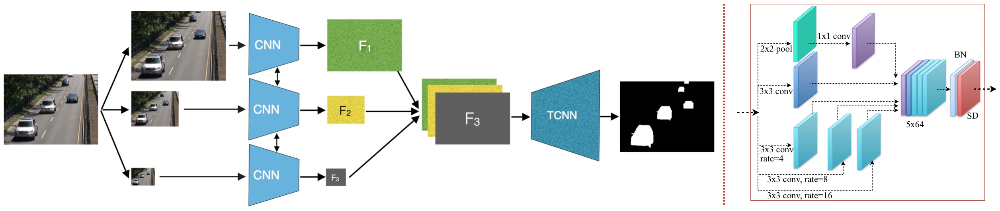

# FgSegNet : Foreground Segmentation Network

This repository contains source codes and training set for the following paper:<br /><br />
***["Foreground Segmentation Using a Triplet Convolutional Neural Network for Multiscale Feature Encoding"](https://arxiv.org/abs/1801.02225)  by Long Ang LIM and Hacer YALIM KELES*** <br /><br />
***Paper Link : https://arxiv.org/abs/1801.02225*** <br/><br/>

<br/>
## Citation
If you find FgSegNet useful in your research, please consider citing: <br />
```
@article{lim2018foreground,
  title={Foreground Segmentation Using a Triplet Convolutional Neural Network for Multiscale Feature Encoding},
  author={Lim, Long Ang and Keles, Hacer Yalim},
  journal={arXiv preprint arXiv:1801.02225},
  year={2018}
}
```

## Requirements
This work was implemented with the following frameworks:
* Python 3.6.3
* Keras 2.0.6
* Tensorflow-gpu 1.1.0

## Usage
Easy to train! Just a SINGLE click, gooo!!! <br />
1. Clone this repo: ``git clone https://github.com/lim-anggun/FgSegNet.git``
2. Modify the following files in ``your installed dir`` with the files in ``utils dir``:
    * ``<Your Keras DIR>\layers\convolutional.py``
    * ``<Your Keras DIR>\backend\tensorflow_backend.py``
    * ``<Your Keras DIR>\keras\losses.py``
    * ``<Your Keras DIR>\metrics.py``
    * ``<Your PYTHON 3.6>\site-packages\skimage\transform\pyramids.py`` <br/>
          replace <br/>
          ```out_rows = math.ceil(rows / float(downscale))``` <br/>
          ```out_cols = math.ceil(cols / float(downscale))``` <br/>
          with <br/>
          ```out_rows = math.floor(rows / float(downscale))```<br/>
          ```out_cols = math.floor(cols / float(downscale))```
3. Download VGG16 weights from [HERE](https://github.com/fchollet/deep-learning-models/releases/download/v0.1/vgg16_weights_tf_dim_ordering_tf_kernels_notop.h5) and place it in appropriate directory (e.g. FgSegNet dir), or it will be downloaded and stored in /.keras/models/ automatically.
4. Download our train+val frames from [HRER](/FgSegNet_dataset2014) and [CDnet2014 dataset](http://changedetection.net), then place them into corresponding directory.<br/>
  
    Example:

    ```
      FgSegNet/
           FgSegNet/FgSegNet.py
                   /FgSegNetModule.py
           FgSegNet_dataset2014/
                     baseline/
                          highway50
                          highway200
                          pedestrians50
                          pedestrians200
                          ...
                      badWeather/
                          skating50
                          skating200
                          ...
                     ...
            CDnet2014_dataset/
                      baseline/
                           highway
                           pedestrians
                           ...
                      badWeather/
                           skating
                           ...
                      ...      
    ```

5. Go to terminal (or command prompt), then change dir path to python codes and train by running the following commands.

```
>cd FgSegNet
>cd FgSegNet
>python FgSegNet.py
```

## Evaluation
### on CDnet2014 dataset

We perform two separated evaluations and report our results on two test splits (``test dev`` & ``test challenge``): <br />
1. We compute our results locally. (on ``test dev`` dataset)
2. We upload our results to [Change Detection 2014 Challenge](http://changedetection.net). (on ``test challenge`` dataset where ground truth values are not shared with the public dataset)<br />
(Both results are reported in our paper. Please refer to it for details)<br />

Compute metrics locally using [CDnet Utilities](http://wordpress-jodoin.dmi.usherb.ca/code/)
#### Note: 
- ``test dev``: by considering only the range of the frames that contain the ground truth labels by excluding training frames (50 or 200 frames)
- ``test challenge``: dataset on the server side (http://changedetection.net)
### on SBI2015 dataset

We split 20% for training (denoted by n frames, where n ∈ [2−148]) and 80% for testing.

### on UCSD Background Subtraction dataset

We perform two sets of experiment: first, we split the frames 20% for training (denoted by n frames, where n ∈ [3 − 23]) and 80% for testing, second we split 50% for training (where n ∈ [7 − 56]) and remaining 50% for testing.

## Results
### Results on CDnet2014 dataset
The table below shows the overall results across 11 categories obtained from [Change Detection 2014 Challenge](http://changedetection.net).

| Methods  | PWC | F-Measure | Speed (320x240, batch-size=1) on NVIDIA GTX 970 GPU |
| ------------- | ------------- | ------------- | ------------- |
| FgSegNet_M  | 0.0559 | 0.9770 | 18fps |
| FgSegNet_S  | 0.0461 | 0.9804 | 21fps |

### Results on SBI2015 dataset
The table below shows the overall *test results* across 14 video sequences.

| Methods  | PWC | F-Measure |
| ------------- | ------------- | ------------- | 
| FgSegNet_M  | 0.9431 | 0.9794 |
| FgSegNet_S  | 0.8524 | 0.9831 |

### Results on UCSD Background Subtraction dataset
:bulb: TODO

## Updates
**TODO**
- add FgSegNet_S (FPM module) source code
- add more results and training frames of other datasets

**09/06/2018:**
- add quantity results on *changedetection.net* (CDnet 2014 dataset)
- add supporting codes

**29/04/2018:**
- add jupyter notebook and model for test prediction.

**27/01/2018:**
- add FgSegNet_M (a triplet network) source code and training frames

## Contact
lim.longang at gmail.com <br/>
Any issues/discussions are welcome.
